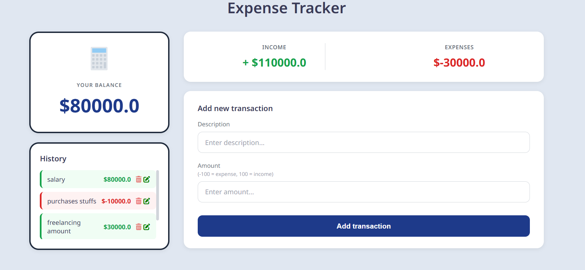
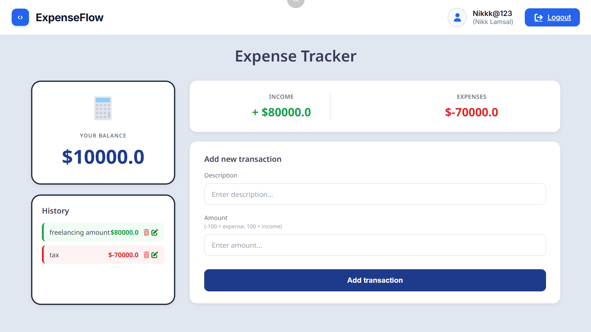
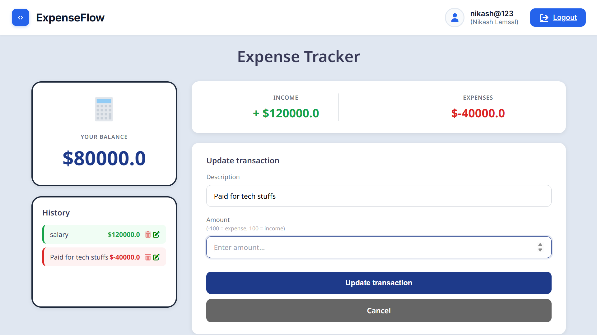
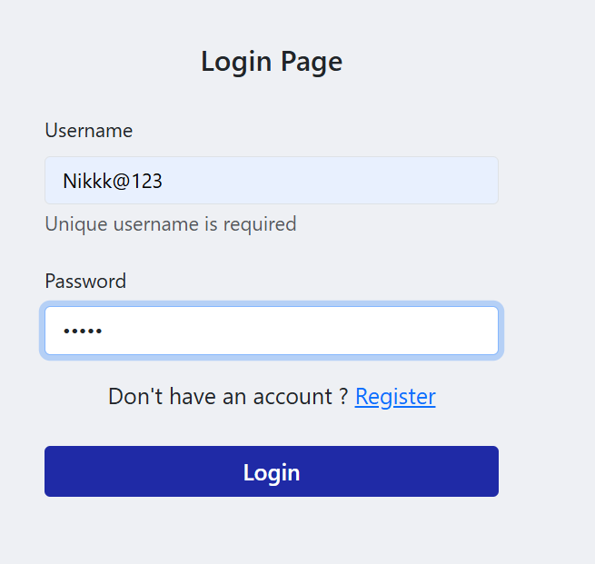
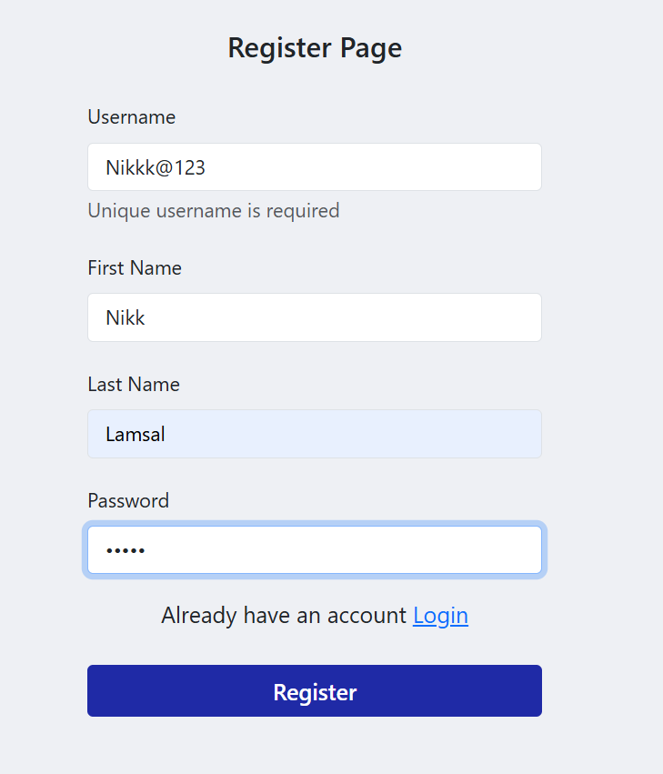

# Expense Tracker – Django Web App

A simple, secure, and efficient **Expense Tracker web application** built using **Django**.  
Users can register, log in, and manage **their own personal** income and expense transactions with full **CRUD** functionality. Each user's data is private and isolated.

This project is great for learning Django authentication, custom user models (or default User), database relationships (ForeignKey), form handling, and building a real-world full-stack application.

## Features

- **User Authentication**  
  - Register / Sign up  
  - Log in / Log out  
  - Each user has their own isolated transaction history  

- **Transaction Management** (per user)  
  - Add new income or expense  
  - View personal transaction history  
  - Edit / Update existing transactions  
  - Delete transactions  

- **Financial Overview**  
  - Real-time total balance calculation  
  - Separate total income and total expenses display  

- **Secure & Clean**  
  - Django’s built-in CSRF protection  
  - Minimal, modern, and responsive UI  

## Tech Stack

- **Backend:** Django (with built-in authentication)  
- **Frontend:** HTML, CSS (clean & minimal design)  
- **Database:** SQLite (default for development)  
- **Server (production-ready):** Gunicorn (recommended)  

## CRUD Functionality

| Operation | Description                              |
|-----------|------------------------------------------|
| Create    | Add new income or expense transaction    |
| Read      | View your personal transaction history   |
| Update    | Edit an existing transaction             |
| Delete    | Remove a transaction from your list      |

## UI Screenshots

### Dashboard View

---

---

---
### Transaction & Form View



## Installation & Setup

Follow these steps to run the project locally:

### 1. Clone the Repository

```bash
git clone https://github.com/your-username/expense-tracker.git

cd expense-tracker

python manage.py runserver
```